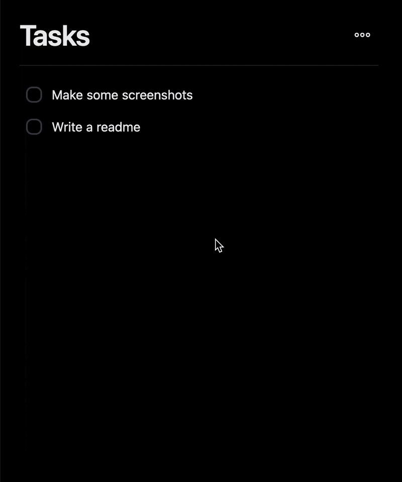
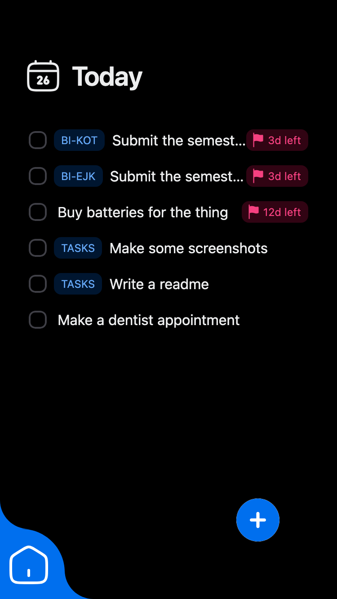
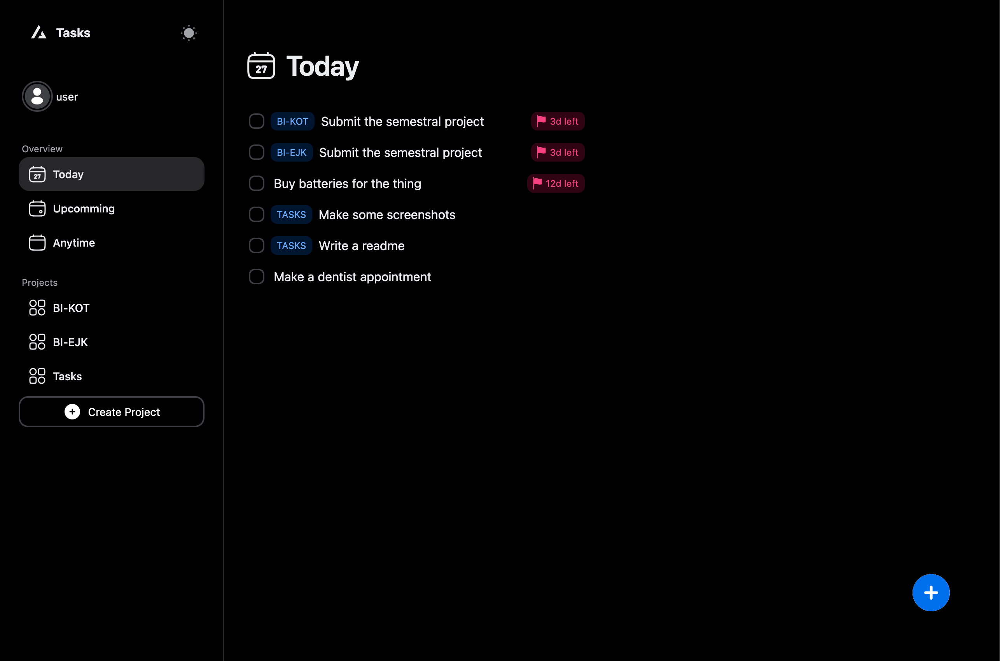
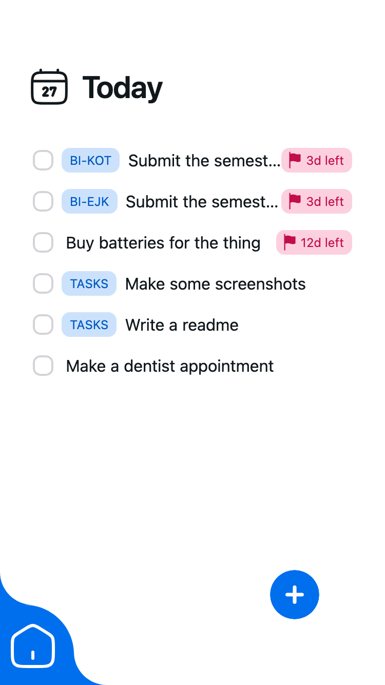
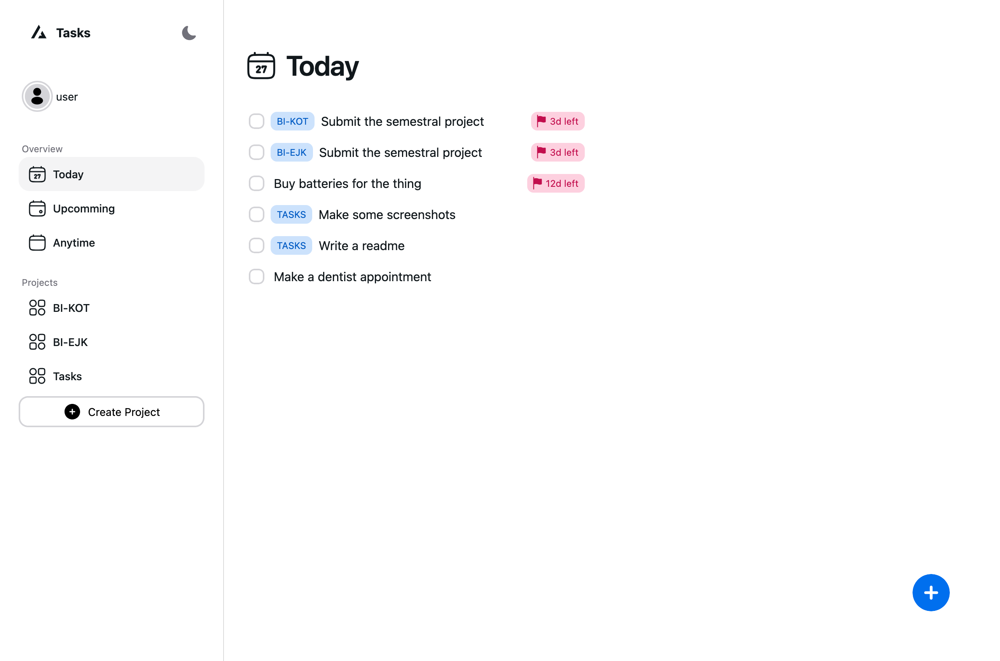

**Tasks Web Client** is a fully-featured, responsive [**Tasks**](https://github.com/devicarus/tasks?tab=readme-ov-file) frontend.

<br>
<h3 align="center">
  A sneak peek 🤫
</h3>
<p align="center">
  
</p>
<p align="center">
  More screenshots in the <a href="#screenshots">Screenshots</a> section below.
</p>
<br>

## Technologies Used

- [Vite](https://vitejs.dev/guide/)
- [HeroUI](https://heroui.com)
- [Tailwind CSS](https://tailwindcss.com)
- [Tailwind Variants](https://tailwind-variants.org)
- [TypeScript](https://www.typescriptlang.org)
- [Framer Motion](https://www.framer.com/motion)
- [TanStack Query](https://tanstack.com/query)
- [TanStack Router](https://tanstack.com/router)
- [TanStack Form](https://tanstack.com/form)

## How to Use

> ⚠️ **WARNING**: This project is currently in development and not yet ready for production use.

> 💡 **TIP**: *Docker image* and *Helm Chart* comming in the near future, stay tuned!

To clone the project, run the following command:

```bash
git clone https://github.com/devicarus/tasks-web-client.git
```

### Install dependencies

You can use one of them `npm`, `yarn`, `pnpm`, `bun`, Example using `npm`:

```bash
npm install
```

### Run the development server

```bash
npm run dev
```

### Screenshots

Mobile             |  Desktop
:-------------------------:|:-------------------------:
  |  
  |  